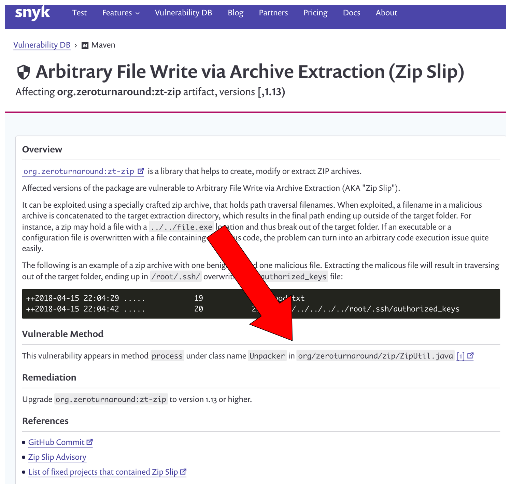
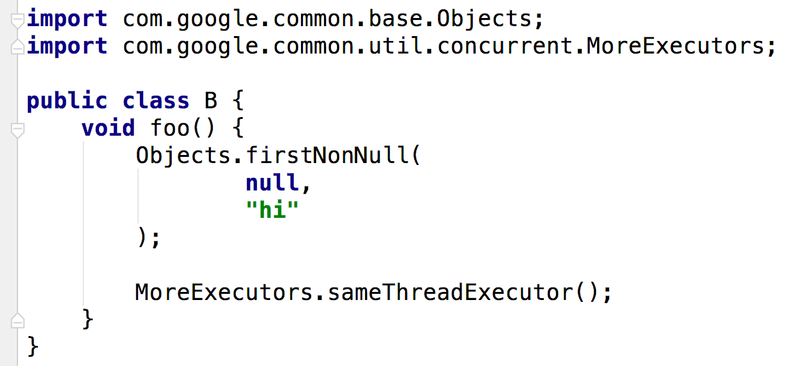

slidenumbers: true

# Spinnaker and the Distributed Monorepo

### Jon Schneider
### `@jon_k_schneider`
#### github.com/jkschneider/springone-distributed-monorepo

---

> **Part 1:** The Spinnaker resource model

---

# CI and CD have distinct orbits


---

# Stitching together source, binaries, and deployed assets.


---

> **Part 2:** Generate a binary callgraph to search for method level vulnerabilities

---



---

> **Part 1:** Rewriting code

---

# Rewrite is a programmatic refactoring tool.


---

# Suppose we have a simple class A.


---

# Raw source code + classpath = Rewrite AST.

```java
String javaSource = /* Read A.java */;
List<Path> classpath = /* A list including Guava */;

Tr.CompilationUnit cu = new OracleJdkParser(classpath)
        .parse(javaSource);

assert(cu.firstClass().getSimpleName().equals("A"));
```

---

# The Rewrite AST covers the whole Java language.


---

# Rewrite's AST is special.

1. Serializable
2. Acyclic
3. Type-attributed

---

# Rewrite's AST preserves formatting.


```java
Tr.CompilationUnit cu = new OracleJdkParser().parse(aSource);
        assertThat(cu.print()).isEqualTo(aSource);

cu.firstClass().methods().get(0) // first method
  .getBody().getStatements() // method contents
  .forEach(t -> System.out.println(t.printTrimmed()));
```

---

# We can find method calls and fields from the AST.


```java
Tr.CompilationUnit cu = new OracleJdkParser().parse(aSource);

assertThat(cu.findMethodCalls("java.util.Arrays asList(..)")).hasSize(1);
assertThat(cu.firstClass().findFields("java.util.Arrays")).isEmpty();
```

---

# We can find types from the AST.


```java
assertThat(cu.hasType("java.util.Arrays")).isTrue();
assertThat(cu.hasType(Arrays.class)).isTrue();

assertThat(cu.findType(Arrays.class))
  .hasSize(1).hasOnlyElementsOfType(Tr.Ident.class);
```

---

# Suppose we have a class referring to a deprecated Guava method.



---

# We can refactor both deprecated references.

```java
Tr.CompilationUnit cu = new OracleJdkParser().parse(bSource);
Refactor refactor = cu.refactor();

refactor.changeMethodTargetToStatic(
  cu.findMethodCalls("com.google..Objects firstNonNull(..)"),
  "com.google.common.base.MoreObjects"
);

refactor.changeMethodName(
  cu.findMethodCalls("com.google..MoreExecutors sameThreadExecutor()"),
  "directExecutor"
);
```

---

# The fixed code emitted from Refactor can be used to overwrite the original source.


```java
// emits a string containing the fixed code, style preserved
refactor.fix().print();
```

---

# Or we can emit a diff that can be used with `git apply`


```java
// emits a String containing the diff
refactor.diff();
```

---

# **refactor-guava** contains all the rules for our Guava transformation.


---

# Just annotate a static method to define a refactor rule.

```java
@AutoRewrite(value = "reactor-mono-flatmap",
             description = "change flatMap to flatMapMany")
public static void migrateMonoFlatMap(Refactor refactor) {
  // a compilation unit for the source file we are refactoring
  Tr.CompilationUnit cu = refactor.getOriginal();

  refactor.changeMethodName(
    cu.findMethodCalls("reactor..Mono flatMap(..)"),
    "flatMapMany");
}
```

---

> **Part 2:** Using BigQuery to find all Guava code in Github

---

# Identify all Java sources from BigQuery's Github copy.

```sql
SELECT *
FROM [bigquery-public-data:github_repos.files]
WHERE RIGHT(path, 5) = '.java'
```

^ In options, save the results of this query to: `myproject:springone.java_files`.
You will have to allow large results as well. This is a fairly cheap query (336 GB).

---

# Move Java source file contents to our dataset.

```sql
SELECT *
FROM [bigquery-public-data:github_repos.contents]
WHERE id IN (
  SELECT id
  FROM [myproject:springone.java_files]
)
```

*Note*: This will eat into your $300 credits.
It cost me ~$6 (1.94 TB).

---

# Cut down the sources to just those that refer to Guava packages.

Getting cheaper now...

```sql
SELECT repo_name, path, content
FROM [myproject:springone.java_file_contents] contents
INNER JOIN [myproject:springone.java_files] files
  ON files.id = contents.id
WHERE content CONTAINS 'import com.google.common'
```

^Notice we are going to join just enough data from `springone.java_files` and `springone:java_file_contents` in order to be able to construct our PRs.

^Save the result to `myproject:springone.java_file_contents_guava`.

^Through Step 3, we have cut down the size of the initial BigQuery public dataset from 1.94 TB to around 25 GB. Much more manageable!

---

# We now have the dataset to run our refactoring rule on.

1. 2.6 million Java source files.
2. 47,565 Github repositories.

---

> **Part 3:** Employing our refactoring rule at scale on <br/>Google Cloud Dataproc.

---

# Create a Spark/Zeppelin cluster on Google Cloud Dataproc.


---

# Monitoring our Spark workers with <br/>Atlas and **spring-metrics**

```java
@SpringBootApplication
@EnableAtlasMetrics // (1)
public class AtlasCollector {
    public static void main(String[] args) {
        SpringApplication.run(AtlasCollector.class, args);
    }
}
```

# ...

---

# Monitoring our Spark workers with <br/>Atlas and **spring-metrics**

```java
@RestController
@Timed // (2)
class TimerController {
  @Autowired MeterRegistry registry; // (3)
  Map<String, Timer> timers =
      new ConcurrentHashMap<>();

  @PostMapping("/api/timer/{name}/{timeNanos}")
  public void time(@PathVariable String name,
    @PathVariable Long timeNanos) {
      timers.computeIfAbsent(name, registry::timer)
          .record(timeNanos, TimeUnit.NANOSECONDS); // (4)
  }
}
```

---

# We'll write the job in a Zeppelin notebook.

1. Select sources from BigQuery
2. Map over all the rows, parsing and running the refactor rule.
3. Export our results back to BigQuery.

---

# Measuring our initial pass.


---

# Measuring how big our cluster needs to be.

1. Rewrite averages 0.12s per Java source file
2. Rate of 6.25 sources per core / second
3. With 128 preemptible VMs, we've got:
    *512 cores * 6.25 sources / core / second*

# 3,200 sources / second = ~13 minutes total

We hope...

---

# After scaling up the cluster with a bunch of cheap VMs.


---

# Some source files are too badly formed to parse.


2,590,062/2,687,984 Java sources = 96.4%.

---

# We found a healthy number of issues.


* 4,860 of 47,565 projects with problems
* 10.2% of projects with Guava references use deprecated API
* 42,794 source files with problems
* 70,641 lines of code affected

---

> *Epilogue:* Issuing PRs for all the patches

---

# Generate a single patch file per repo.

```sql
SELECT repo, GROUP_CONCAT_UNQUOTED(diff, '\n\n') as patch
FROM [cf-sandbox-jschneider:springone.diffs]
GROUP BY repo
```

---

> **Thanks for attending!**
