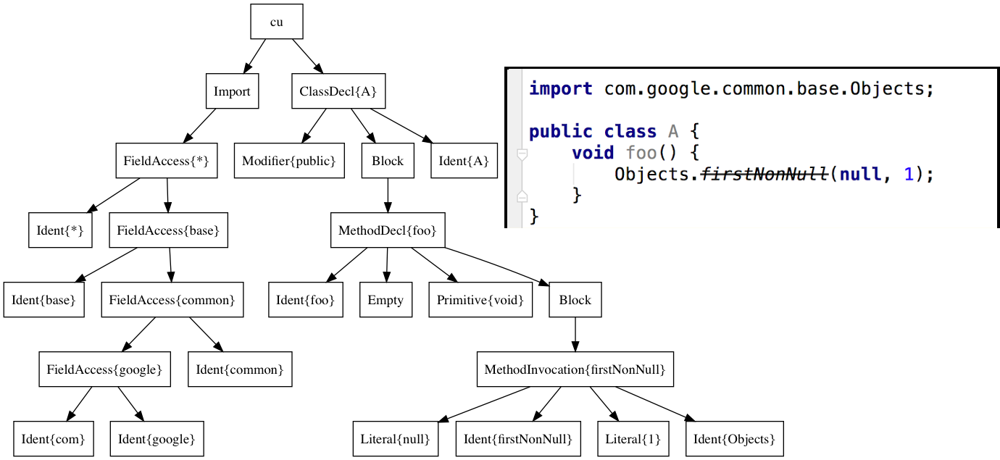

footer: github.com/jkschneider/gradle-summit-2017
slidenumbers: true

# Distributed Refactoring
# across GitHub

### Jon Schneider
### Pivotal, Inc.
### `@jon_k_schneider`


---

# TODO Guava blowing up at runtime.

---

# We will tackle this in 3 parts.

* Netflix Rewrite to refactor them
* Google BigQuery to find Java files
* Zeppelin/Spark on Dataproc to compute

---

# Part 1: Rewriting code

---

# Rewrite is a programmatic refactoring tool.


---

# Suppose we have a simple class A.


---

# Raw source code + classpath = Rewrite AST.

```java
String javaSource = /* Read A.java */;
List<Path> classpath = /* A list including Guava */;

Tr.CompilationUnit cu = new OracleJdkParser(classpath)
        .parse(javaSource);

assert(cu.firstClass().getSimpleName().equals("A"));
```

---

# The Rewrite AST covers the whole Java language.



---

# Rewrite's AST is special.

1. Serializable
2. Acyclic
3. Type-attributed

---

# Rewrite's AST preserves formatting.


```java
Tr.CompilationUnit cu = new OracleJdkParser().parse(aSource);
        assertThat(cu.print()).isEqualTo(aSource);

cu.firstClass()
  .methods().get(0)
  .getBody()
  .getStatements()
  .forEach(t -> System.out.println(t.printTrimmed()));
```

---

# We can find method calls and fields from the AST.


```java
Tr.CompilationUnit cu = new OracleJdkParser().parse(aSource);

assertThat(cu.findMethodCalls("java.util.Arrays asList(..)")).hasSize(1);

assertThat(cu.firstClass().findFields("java.util.Arrays")).isEmpty();
```

---

# We can find types from the AST.


```java
assertThat(cu.hasType("java.util.Arrays")).isTrue();
assertThat(cu.hasType(Arrays.class)).isTrue();

assertThat(cu.findType(Arrays.class))
  .hasSize(1)
  .hasOnlyElementsOfType(Tr.Ident.class);
```

---

# Suppose we have a class referring to a deprecated Guava method.


---

# We can refactor both deprecated references.

```java
Tr.CompilationUnit cu = new OracleJdkParser().parse(bSource);

Refactor refactor = cu.refactor();
refactor.changeMethodTargetToStatic(
  cu.findMethodCalls("com.google..Objects firstNonNull(..)"),
  "com.google.common.base.MoreObjects"
);

refactor.changeMethodName(
  cu.findMethodCalls("com.google..MoreExecutors sameThreadExecutor()"),
  "directExecutor"
);
```

---

# The fixed code emitted from Refactor can be used to overwrite the original source.


```java
// emits a string containing the fixed code, style preserved
refactor.fix().print();
```

---

# `refactor-guava` contains all the rules for our Guava transformation.


---

# Or we can emit a diff that can be used with `git apply`


```java
// emits a String containing the diff
refactor.diff();
```

---

# Part 2: Using BigQuery to find all Guava code in Github

---

# Identify all Java sources from BigQuery's Github copy.

```sql
SELECT * FROM [bigquery-public-data:github_repos.files]
WHERE RIGHT(path, 5) = '.java'
```

^ In options, save the results of this query to: `myproject:gradle_summit.java_files`.
You will have to allow large results as well. This is a fairly cheap query (336 GB).

---

# Move Java source file contents to our dataset.

```sql
SELECT *
FROM [bigquery-public-data:github_repos.contents]
WHERE id IN (SELECT id FROM [myproject:gradle_summit.java_files])
```

*Note*: This will eat into your $300 credits.
It cost me ~$6 (1.94 TB).

---

# Cut down the sources to just those that refer to Guava packages.

Getting cheaper now...

```sql
SELECT repo_name, path, content FROM [myproject:gradle_summit.java_file_contents] contents
INNER JOIN [myproject:gradle_summit.java_files] files ON files.id = contents.id
WHERE content CONTAINS 'import com.google.common'
```

^Notice we are going to join just enough data from `gradle_summit.java_files` and `gradle_summit:java_file_contents` in order to be able to construct our PRs.

^Save the result to `myproject:gradle_summit.java_file_contents_guava`.

^Through Step 3, we have cut down the size of the initial BigQuery public dataset from 1.94 TB to around 25 GB. Much more manageable!

---

# We now have the dataset to run our refactoring rule on.

1. 2.6 million Java source files.
2. TODO Github repositories.

---

# Part 3: Employing our refactoring rule at scale on Google Cloud Dataproc.

---

# Create a Spark/Zeppelin cluster on Google Cloud Dataproc.

Two initialization actions:

1) `gs://dataproc-initialization-actions/zeppelin/zeppelin.sh`
2) `gs://gradle-summit-2017-rewrite/atlas-dataproc-init.sh`

---

# TODO Diagram of the cluster showing Atlas and collector running on master

---

# Monitoring our Spark workers with Atlas

```java
@SpringBootApplication
@EnableAtlasMetrics // (1)
public class AtlasCollector {
    public static void main(String[] args) {
        SpringApplication.run(AtlasCollector.class, args);
    }
}

@RestController
@Timed // (2)
class TimerController {
    @Autowired MeterRegistry registry; // (3)
    final Map<String, Timer> timers = new ConcurrentHashMap<>();

    @PostMapping("/api/timer/{name}/{timeNanos}")
    public void time(@PathVariable String name, @PathVariable Long timeNanos) {
        timers.computeIfAbsent(name, registry::timer)
            .record(timeNanos, TimeUnit.NANOSECONDS); // (4)
    }
}
```

---

# We'll scale the cluster to 128 preemtible VMs and go!


---

# Some source files are too badly formed to parse.


2,590,062/2,687,984 Java sources = 96.4%.

---

# We found a healthy number of issues.


